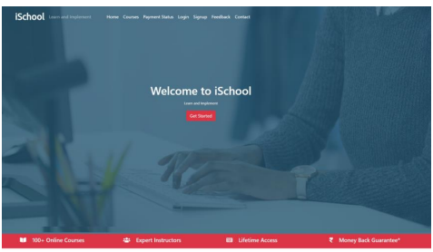
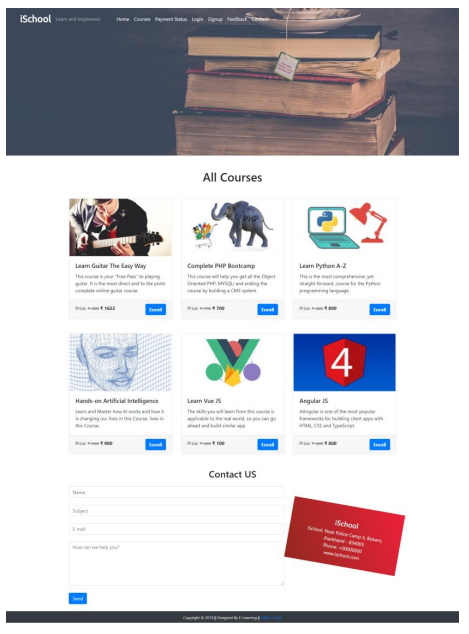
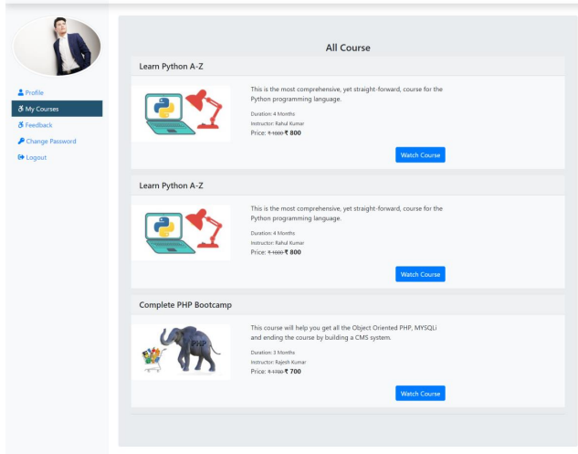
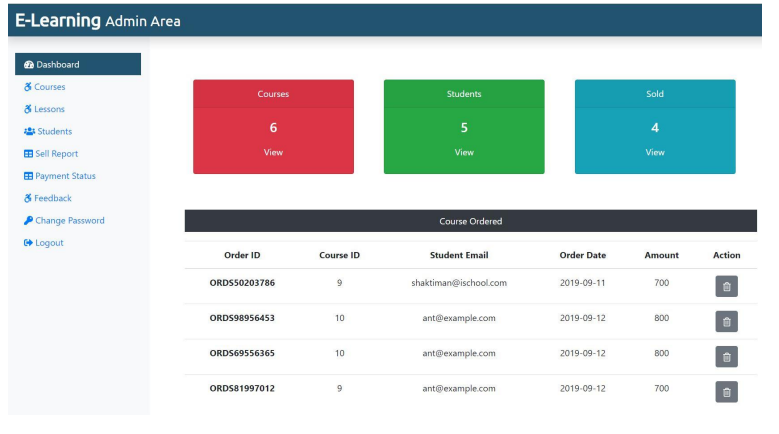
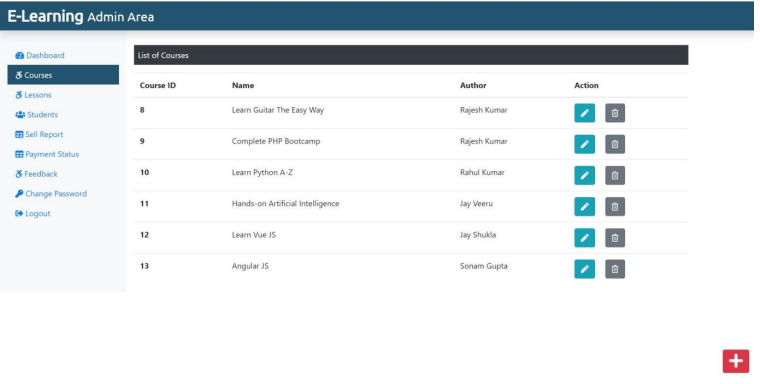
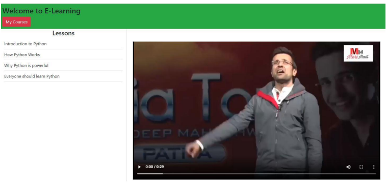

# iSchool-ELearning Management System

iSchool (E-Learning Management System)” is comes under the Web Based Application. This application is developed with the help of HTML, CSS, Bootstrap, PHP, MySQL. iSchool is a powerful Learning Management System implementing the latest trends in e-learning. A flexible web-based learning experience allows you to go through a guided 
curriculum or choose lessons on an as-needed basis.

## Technologies used in the project

<h2>Front-end:</h2>
- HTML, CSS, Javascript, Bootstrap

<h2>Back-end:</h2>
- PHP, MySQL

## MODEL:

* Agile model.

## Future Scope

* More than one tutor can be added 
* Interaction between Student and Tutor can be improved by introducing Discussion forum
* Quiz Facility may enhance this application’s market value
* Live Class can be added
